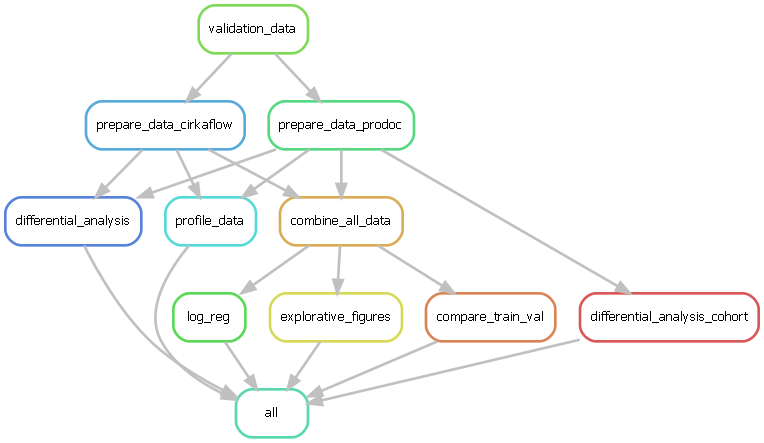

# Workflow execution

Needs to be in two steps (until the input function problem is solved)

```
snakemake -pk -c 3 -n
```


## Rule Graph

```bash
snakemake --forceall --rulegraph | dot -Tpdf > rulegraph.pdf # rule graph
snakemake --forceall --rulegraph | dot -Tpng > rulegraph.png # rule graph
```

